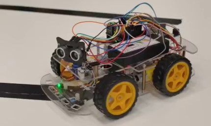

# carGoesVroom

In this project, we built and programmed a mobile robot using an Arduino and a commercial kit to explore how robots navigate their environment. The goal was to get hands-on experience with robot assembly, programming, and testing navigation strategies.

## What We Did

- **Hardware Integration:** Assembled the robot platform and interfaced sensors/actuators with an Arduino microcontroller.
- **Algorithm Development:** Implemented and tested various navigation strategies, ranging from simple obstacle avoidance to path-following.
- **Data Collection:** Analyzed real-world performance metrics to evaluate the efficiency of different control methods.

## What We Learned
* **Reactive Control:** Highly effective for basic tasks (obstacle avoidance) but limited by a lack of "memory" or global mapping.
* **Sensor Limitations:** Discovered that ultrasonic sensors have a "blind spot" at very short distances, leading to measurement errors.
* **Theory vs. Practice:** Highlighted the trade-offs between computational simplicity and navigation reliability.

## Reflection

This project was a great way to see the theory meet the real world. It taught us that programming a robot isn’t just about code—it’s also about understanding sensors, mechanical behavior, and how algorithms perform in practice. Even small limitations, like sensor accuracy, can have a big impact on navigation.

### Future Improvements
- [ ] Add PID control for smoother motor acceleration.
- [ ]  Implement Bluetooth control for manual override.
